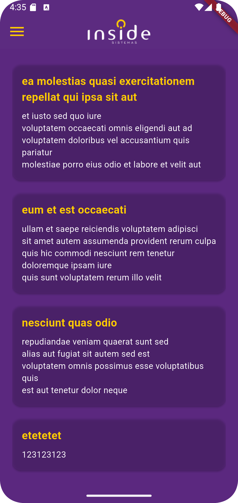
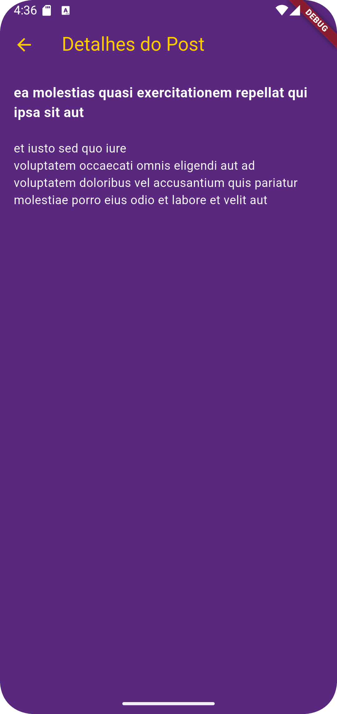
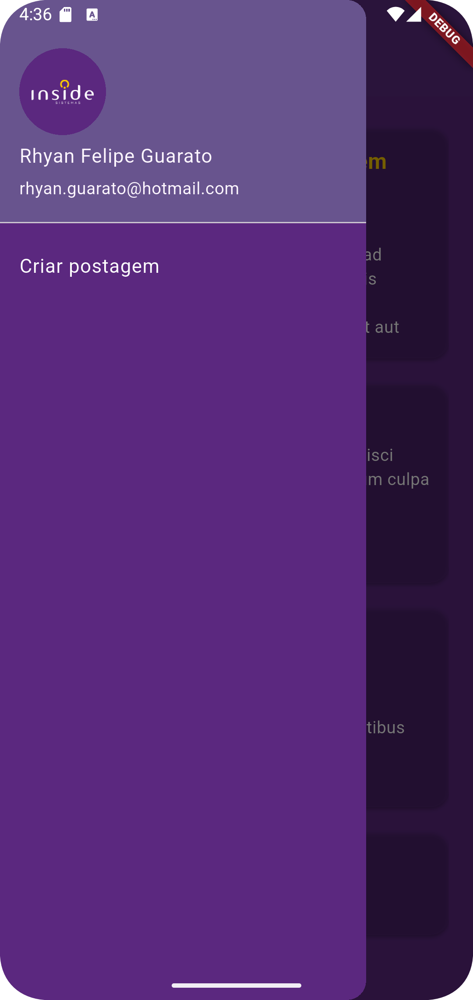
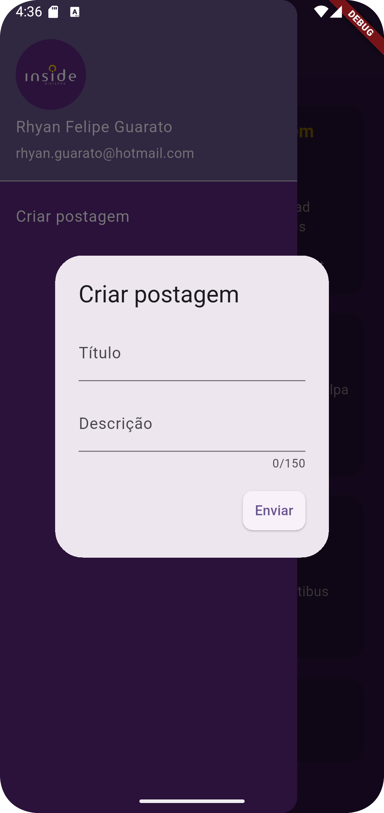

# inside_sistemas_teste_app

Projeto desenvolvido utilizando a ultima versão do flutter. 

## Tela Inicial

Aqui está a tela inicial do aplicativo:

## Detalhamento do Post

Esta é a tela de detalhamento de um post. O título e a descrição.

## Drawer (Menu Lateral)

O menu lateral (Drawer).

## Registro de post

Esta é a tela de registro

